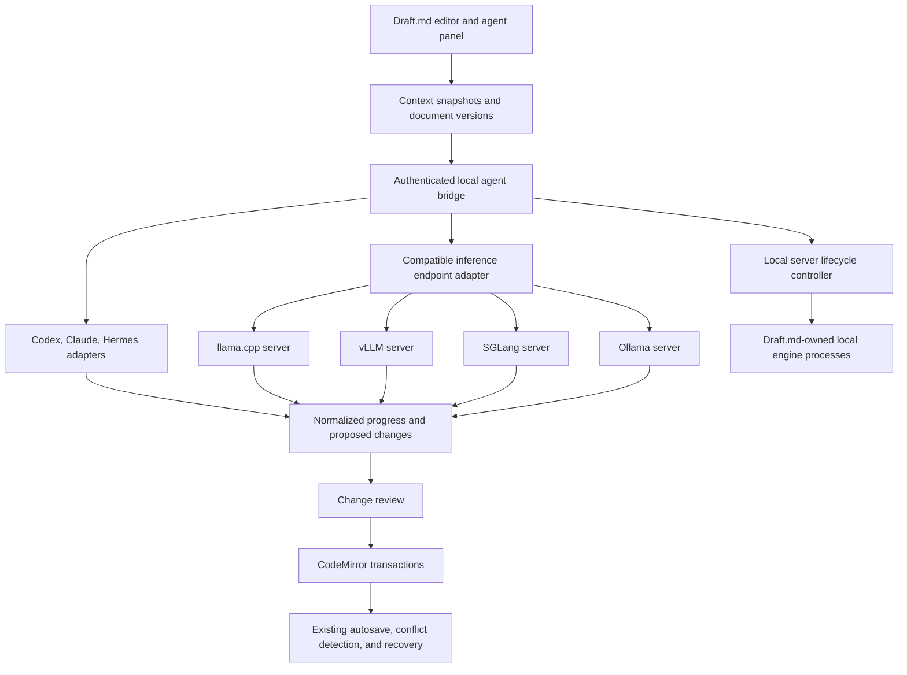

# Agentic writing implementation plan

Status: implementation started on `agentic-writing`. Local inference-server controls, small-model selection, and a inline writing shortcuts with remembered profiles, automatic startup, and direct undoable insertion are implemented. Local Codex/Claude Code writing and experimental ChatGPT/Claude website adapters are implemented. Multi-step writing agents and document-wide reviewed edits remain planned.

## Implementation progress

- Implemented: Settings → AI Agent, local start/stop and startup cancellation for four installed engines, existing-server connections, model discovery, bounded logs, authenticated same-origin bridge routes, and launcher shutdown cleanup.
- Verified through fake engine processes and browser fixtures. Real Ollama writing and automatic restart were also tested on this machine; other real runtime/GPU combinations remain unverified.
- Implemented model selection: LiquidAI/LFM2.5-2.6B default, four additional small candidates, native local-path browsing, remembered checked paths, GGUF/Safetensors parameter counting, a strict 4B local limit, a 4,096-token default context, and verified installed-model selection for Ollama. Ollama downloads the chosen supported model on first invocation with inline progress; other engine weights remain manual.
- Implemented writing harness: remembered engine/model/path profiles, automatic startup/reconnection, document-native writing with no agent panel, `@agent` and engine-specific direct writing commands, bounded current-note/selection context, Markdown writing rules, incremental token streaming in one undo group, Escape cancellation, and recovery when the note changes concurrently. See [harness rules and boundaries](docs/agent-writing-harness.md).
- Initial limits: one live connection per engine, required model-discovery routes, existing local weights, current CLI launch profiles, and basic advanced options. No hardware certification, automatic orphan recovery, or arbitrary engine flags yet. External compatible model selection stays disabled when its size cannot be verified. Credentials remain session-only.
- Implemented additional providers: local Codex app-server and Claude Code print-mode streaming, saved default-provider choice, authenticated cancellation and subprocess cleanup, plus a paired Manifest V3 extension for ChatGPT/Claude website writing. Both real CLIs and controlled website fixtures were tested; live signed-in website variants remain unverified. See [provider setup and limits](docs/agent-providers.md).
- Next: broader live website compatibility checks, capability discovery, stronger inference-engine cancellation, multi-step tools, and document-wide edit review.

See [local server setup and current behavior](docs/local-models.md). The sections below remain the target design; items not listed as implemented are not shipped functionality.

Prepared October 9, 2026. Provider capabilities and authentication requirements must be rechecked before implementation.

## Objective

Add optional agentic writing to Draft.md through `@codex`, `@claude`, `@hermes`, `@llama.cpp`, `@vllm-engine`, `@sglang`, and `@ollama`. Users should be able to supply an instruction, choose relevant notes, inspect proposed changes, and accept edits without losing control of their files.

Use one shared writing interface with provider adapters. Preserve normal editing, offline use, portable Markdown, and the existing lightweight installation when agents are disabled.

Assumptions:

- `@codex` means the local Codex agent runtime.
- `@claude` means an agent powered by the Claude Agent SDK.
- `@hermes` means Nous Research's Hermes Agent, rather than a Hermes model served through another engine.
- `@llama.cpp`, `@vllm-engine`, `@sglang`, and `@ollama` support both starting an installed local server from Draft.md and connecting to an already-running local or remote server.
- Local server controls are deliberately minimal. Automatic runtime installation, GPU provisioning, remote process management, and a model-download catalog are outside the initial scope. Ollama invocation downloads the chosen supported small model if missing. Other engines use existing local model files.
- The first supported environment is the locally installed Draft.md app on macOS and Linux.

## Difficulty and effort

The autocomplete UI is a relatively small extension. Reliable editing, process lifecycle management, authentication, and consistent tool permissions across providers account for most of the work.

Planning estimates assume one experienced developer working full-time, with time for tests and integration debugging. They are estimates, not delivery commitments.

| Stage                | Result                                                                | Estimated effort  |
| -------------------- | --------------------------------------------------------------------- | ----------------- |
| Integration spike    | Verify streaming, cancellation, authentication, and restricted tools  | 3–5 working days  |
| Single-provider MVP  | Context selection, streamed suggestions, review, accept/discard, undo | 2–3 weeks         |
| Remaining providers  | Shared endpoint adapter and additional native agent adapters          | Another 2–4 weeks |
| Production hardening | Packaging, recovery, permission tests, platform verification          | Another 2–4 weeks |

Allow roughly 6–12 weeks for the writing integrations, plus approximately 1–3 weeks for local server controls and their lifecycle tests: roughly 7–15 weeks overall for all seven integrations. These are planning estimates, not measured schedules. Ollama and SGLang share endpoint infrastructure but need their own compatibility checks. A small interface still requires substantial process cleanup, readiness detection, and platform validation. Discovery may change the estimate.

## Proposed user experience

Examples:

```text
@codex Turn these notes into a clear project proposal.
@claude Rewrite the selected paragraph more concisely.
@hermes Compare these documents and draft a summary.
@llama.cpp Convert this section into actionable tasks.
@vllm-engine Improve the structure without changing the facts.
@sglang Draft a summary using the model on my running server.
@ollama Turn this outline into a first draft using my local model.
```

1. The user types `@` and chooses an agent from autocomplete.
2. Draft.md opens an instruction panel without sending document content.
3. The panel shows the engine, model where available, destination, and included context.
4. The user chooses the selection, current note, or explicitly attached workspace notes.
5. The user enters an instruction and presses **Run**.
6. Output and useful tool activity appear in a separate suggestion view.
7. The user reviews changes and chooses **Accept**, **Accept selected changes**, or **Discard**.
8. Accepted edits enter the normal editor history and saving flow.

Agent suggestions, workspace-note links, and date insertions should appear in separate autocomplete groups. Agent names must not prevent linking a note with the same name. Typing a mention in prose or choosing an autocomplete entry must never start an inference request by itself.

The invocation is a UI action; it should not leave a control token in the saved note. Preserve the original selection and restore its text if the user cancels. Keep the existing suppression of suggestions inside code and math. Test punctuation in `llama.cpp` and the hyphen in `vllm-engine`.

Initial writing actions:

- Rewrite or shorten a selection.
- Expand an outline or rough notes.
- Summarize an included note.
- Suggest document structure.
- Extract tasks or draft a to-do list.
- Generate or repair Markdown and supported LaTeX tables.

Treat factual claims and references as suggestions requiring review. Preserve provided source attribution, distinguish retrieved material from model-generated text, and avoid presenting invented citations as verified sources.

## Architecture



### Browser application

The browser owns document content, granted folder handles, editor state, review, and applying changes. Reuse Draft.md's existing document controller and filesystem adapters.

Capture the latest editor text, including unsaved edits, rather than assuming disk contents match the editor. Browser-managed workspaces cannot be handed to a local executable as an absolute filesystem path. Their approved context must be transferred explicitly through the bridge.

### Local agent bridge

The existing Python launcher serves static application assets. Agent integration requires an optional companion process or a clearly separated service module that adds:

- Provider discovery and connection checks.
- Credential handling outside browser storage.
- Process startup and shutdown.
- Run IDs, sessions, cancellation, and bounded timeouts.
- Streamed events and tool requests.
- Per-run context and permission boundaries.

Keep the static editor usable without the bridge. Reuse the local launcher's lifecycle and host checks where appropriate, while treating the new agent API as a distinct authenticated interface.

Prefer an isolated Python environment for optional bridge dependencies, subject to the integration spike. Do not require Node.js for every Draft.md installation simply because one adapter needs it. Provider-specific executables and runtimes must be detected and explained in setup.

Use authenticated local streaming, such as SSE with a fetch-based client and cancellation endpoint. Choose the final transport during the spike. Validate exact origins and hosts, bind to loopback, authenticate all agent operations, and avoid putting credentials in URLs. A loopback address alone is not authorization.

The first version should support the installed local app. A publicly hosted Draft.md page connecting to localhost needs separate investigation of browser connection permissions, origins, and transport restrictions.

### Shared run contract

Each adapter should expose the same application-level operations:

- Discover capabilities and report readiness.
- Start a run with an immutable context snapshot.
- Emit normalized progress, output, tool requests, usage when available, and errors.
- Cancel a run and clean up its processes.
- Resume a conversation only where the provider supports it.
- Return proposed document changes, not uncontrolled workspace writes.

Represent capabilities explicitly: streaming, tools, cancellation, session resume, structured output, and usage reporting. Do not promise identical capabilities or cost estimates across engines.

Useful run states are `connecting`, `running`, `waiting-for-approval`, `completed`, `cancelled`, and `failed`. Stream user-facing activity summaries and tool results; the UI does not need private model reasoning.

## Provider integration strategy

| Mention        | Proposed integration                                                                | Main work                                                                                                            |
| -------------- | ----------------------------------------------------------------------------------- | -------------------------------------------------------------------------------------------------------------------- |
| `@codex`       | Codex App Server through a local stdio adapter; evaluate the Python SDK as a client | Authentication, threads, streamed events, tool restrictions, approvals, cancellation                                 |
| `@claude`      | Claude Agent SDK through an optional local adapter                                  | Supported credentials, tool allowlists/hooks, sessions, streamed events, runtime setup                               |
| `@hermes`      | Evaluate ACP first; consider its HTTP API for a narrower integration                | Mapping permissions, tools, diffs, sessions, memory, and cancellation                                                |
| `@llama.cpp`   | Existing `llama-server` endpoint through the compatible API adapter                 | Model discovery, streaming, structured suggestions, model/template-specific tool handling                            |
| `@vllm-engine` | Existing vLLM endpoint through the compatible API adapter                           | Endpoint authentication, model discovery, streaming, parser/configuration compatibility                              |
| `@sglang`      | Already-running SGLang endpoint through the compatible API adapter                  | Endpoint configuration, authentication, model discovery, streamed responses, and model/parser-specific tool behavior |
| `@ollama`      | Ollama compatible inference API, with native API discovery where needed             | Installed model selection, streaming, tool capabilities, and distinguishing an existing daemon from an owned process |

All four inference engines can use an existing endpoint or one launched locally through the server controller. Launching a process and running a writing agent are separate responsibilities.

Codex App Server is designed for rich integrations with authentication, history, approvals, and streamed events. Prefer stdio for the initial bridge; its documented WebSocket transport has experimental limitations. See the [official App Server documentation](https://learn.chatgpt.com/docs/app-server) and [Codex SDK documentation](https://learn.chatgpt.com/docs/codex-sdk).

The [Claude Agent SDK](https://code.claude.com/docs/en/agent-sdk/overview) provides the Claude Code agent loop through Python and TypeScript interfaces. Plan for supported API-key authentication rather than assuming a user's Claude subscription can authenticate a third-party product. Verify current authentication and distribution requirements before shipping.

[Hermes integrations](https://hermes-agent.nousresearch.com/docs/integrations/) document ACP editor integration and an OpenAI-compatible HTTP API. Validate which path exposes the permissions and events Draft.md needs. Disable or scope persistent memory and background capabilities unless the user explicitly enables them.

[llama.cpp's server](https://github.com/ggml-org/llama.cpp/blob/master/tools/server/README.md) and [vLLM's server](https://docs.vllm.ai/en/v0.30.0/serving/online_serving/openai_compatible_server/) expose compatible inference APIs. Compatibility is not a guarantee of identical behavior. Tool use depends on the loaded model, template, parser, and server configuration.

SGLang is an equally supported endpoint target, not a vLLM alias. Its [serving documentation](https://docs.sglang.ai/developer_guide/bench_serving) describes OpenAI-compatible chat routes, model discovery, streaming, and bearer authentication. Verify the actual deployed version and its tool-call configuration during discovery.

Codex, Claude, and Hermes bring their own agent loops. Preserve those loops behind adapters rather than rebuilding them. For llama.cpp, vLLM, SGLang, and Ollama, Draft.md needs a bounded loop that sends tool results back to the model, validates tool arguments, and stops on completion, cancellation, or budget exhaustion. Unsupported tool behavior should fall back to suggestion-only writing.

### Minimal local server interface

Add one **AI Agent** panel, reachable from agent setup and settings. Keep the default view to:

1. **Engine:** Ollama, llama.cpp, vLLM, or SGLang.
2. **Mode:** **Start locally** or **Connect to existing**.
3. **Model:** an installed model selector or local model-path input; llama.cpp accepts a GGUF file. Ollama lists installed models separately because its daemon serves multiple models and loads them on demand.
4. **Start / Stop:** one primary action for a server owned by Draft.md, or **Connect / Disconnect** for an existing server.
5. **Status:** Stopped, Starting, Running, Stopping, or Error, with a short actionable explanation.

After a successful start, automatically select that connection for the corresponding writing mention. Show the active model and connection in the instruction panel. Do not start inference or send notes simply because the server becomes ready.

Place executable/environment selection, port, context length, GPU options, and validated engine-specific flags under a collapsed **Advanced** section. Add a small expandable **Logs** view for startup errors. Avoid a terminal, GPU dashboard, or infrastructure management screen in the first version.

Detect installed runtimes and existing services before offering Start. If Ollama is already running as an OS service, reuse it as an external connection; Disconnect must not stop that service. Stopping the Ollama server and unloading a model are different operations, and the UI must not confuse them.

Missing runtimes or models should produce setup guidance. Do not silently install packages, drivers, or download model weights. Initially accept cached/local models; if a model identifier could trigger a download, require an explicit download action before starting it. Check hardware/backend compatibility and show why local Start is unavailable, while retaining Connect to existing. Supporting macOS/Linux for Draft.md does not imply every engine/backend runs on both.

### Local server lifecycle

The optional local bridge owns server processes. A static browser-only deployment can connect only through a suitable bridge; it cannot launch operating-system processes itself. Keep server lifecycle APIs separate from writing adapters and scoped agent tools.

Use version-tested engine launch profiles: Ollama's `ollama serve`, llama.cpp's `llama-server` with a model file, vLLM's serving command, and the installed SGLang version's supported serving entry point. Resolve executable paths and construct argument arrays without shell interpolation. User input and model output must never become arbitrary shell commands. Bind launched servers to loopback by default.

Before starting, validate model availability, runtime/backend compatibility, and port availability. Reject a conflicting port without killing its occupant. Serialize duplicate starts. Mark Running only after API readiness succeeds, rather than when a PID exists; model loading can take time. Provide startup cancellation and a bounded, configurable readiness timeout.

Track owned process identity, launch configuration, and worker process groups. Stop gracefully, then terminate only verified owned processes if necessary; account for child workers and PID reuse. Surface crashes, out-of-memory errors, and missing dependencies with bounded, redacted logs. Never automatically replay a writing request after restarting a server.

Closing a browser tab must not stop a server shared by other Draft.md tabs. Proposed default: stopping the Draft.md bridge or `dmd stop` also stops its owned servers; restarting cleans them up before relaunch. Externally managed local/remote servers always remain running. Document this policy and test abnormal bridge shutdown and recovery so orphaned workers are detected without killing unrelated processes.

Implementation references: [Ollama CLI](https://docs.ollama.com/cli), [installed-model discovery](https://docs.ollama.com/api/tags), [SGLang quickstart](https://github.com/sgl-project/sglang/blob/main/docs/docs/get-started/quickstart.mdx), and [vLLM backend requirements](https://docs.vllm.ai/en/latest/getting_started/installation/gpu/). Pin tested runtime versions rather than assuming launch commands or hardware support remain constant.

### Connecting to a live inference server

The setup panel should accept an engine preset, user-defined connection name, API base URL, optional API key, and model ID. For example, a user could configure an SGLang server as `http://127.0.0.1:30000/v1`, an HTTPS remote endpoint, or an existing SSH-forwarded endpoint. Addresses are examples, not discovery assumptions; ports and routes must remain configurable.

Use the bridge to query `/v1/models` when available, offer the returned models, and allow an explicit model ID when discovery is unavailable. Provide a connection check that distinguishes connectivity and authentication from an optional inference check. Report unsupported routes, an unavailable model, malformed stream events, and missing tool support clearly.

Support multiple saved connections to the same engine. Selecting `@sglang` should use a configured default or prompt for the intended connection/model before running. Reconnection must not replay an interrupted writing request automatically.

The bridge must connect only to explicitly configured destinations, handle optional credentials securely, and validate redirects before forwarding credentials. Prefer HTTPS for remote servers. SSH tunnels and remote server startup remain user-managed in the first version. Draft.md can start its own local servers, but must never stop or reconfigure an externally managed server.

Keep server availability separate from model capabilities. A reachable SGLang endpoint may support text streaming but not the tool behavior required for an agentic task. Advertise only verified capabilities and retain suggestion-only writing as a fallback. Track server/model/parser combinations separately for SGLang, vLLM, llama.cpp, and Ollama rather than assuming one engine's passing tests cover the others. Use Ollama's native installed-model discovery where its compatible discovery route is insufficient.

Do not scrape interactive terminal output when structured protocols are available. Pin tested adapter/runtime versions and maintain compatibility checks.

## Context and tool permissions

Start with explicit context attachment. Do not automatically upload an entire workspace.

Each run should identify:

- Provider, model, and endpoint destination.
- Instruction and action type.
- Selected text and its document/range version.
- Included note paths and content hashes.
- Allowed tools and maximum context size.
- Timeout, tool-step limit, and available usage limits.

Initial tools:

| Tool                   | Boundary                                                                                          |
| ---------------------- | ------------------------------------------------------------------------------------------------- |
| Read note              | Only explicitly approved notes or approved workspace scope                                        |
| Search notes           | Search only the approved scope; adding a newly found note to cloud context must follow that scope |
| Inspect headings/tasks | Read-only structured document information                                                         |
| Propose edit           | Return a change against a known snapshot                                                          |
| Propose note           | Stage a new file for review; use existing collision handling on acceptance                        |

A bridge or MCP tool layer can expose these operations to native agents. The exact transport depends on each provider's capabilities.

Disable built-in shell access and direct writes to the real workspace in the MVP. An adapter must not bypass Draft.md's tools through its runtime's default filesystem capabilities. Where necessary, run against approved snapshots in an actual restricted execution environment, then import changes for review. A temporary directory alone does not enforce isolation.

Treat document text as untrusted task material, including instructions embedded in notes. Validate tool paths, reject traversal and unauthorized references, constrain context sizes, and keep execution permissions separate from the user's writing instruction.

## Applying changes and handling conflicts

1. Capture the original text, document version/hash, and selected range when a run starts.
2. Store streamed output separately from the document.
3. Validate proposed changes against the captured snapshot.
4. Show a readable diff and permit whole-change acceptance; add reliable per-change acceptance after the basic path works.
5. Recheck the live document before applying anything.
6. If it changed, reconcile only when the result is unambiguous; otherwise preserve the suggestion and request another review or regeneration.
7. Apply accepted edits through CodeMirror transactions with coherent undo behavior.
8. Let the existing document controller handle autosave, recovery, and external-file conflicts.

Never interpret arbitrary generated text as commands or silently apply a patch to a different document. Switching tabs during a run must retain its original target. A failed provider or cancelled run must leave original text intact. Multi-note proposals should be staged together, with explicit handling of partial failures; the filesystem does not provide a cross-file atomic transaction.

## Privacy, credentials, and product promises

- Agent support is opt-in and ordinary editing remains usable offline.
- Show whether processing is local, on a remote server, or through a cloud provider.
- A local agent executable can still send content to a cloud model. Do not label that path fully offline.
- Prefer OS credential storage where available; use protected local configuration as a documented fallback. Never place keys in Markdown, Git, browser localStorage, logs, or exported workspaces.
- Store conversation history separately from notes, with clear retention and deletion controls.
- Do not persist full prompts or document snapshots in diagnostic logs by default.
- Surface cancellation, timeouts, and provider-reported usage. Do not invent exact cost figures for engines that do not report them.

Draft.md's current claims that notes are never uploaded and that the app has no AI service need qualified wording before this feature ships. Normal editing can retain those guarantees; explicitly enabled cloud assistance cannot.

## Implementation phases and exit criteria

### Phase 0: integration discovery

Verify the seven providers' current protocols, supported credentials, runtime requirements, and capability boundaries. Exercise streaming, cancellation, malformed responses, and unavailable engines. Confirm native tools can be constrained sufficiently for review-first writing. Spike local start/readiness/stop for each of the four inference engines and record supported OS/backend combinations.

Exit: document the supported version matrix, choose bridge transport and packaging, and identify a working single-provider path. If a runtime cannot enforce required boundaries, keep it suggestion-only or defer it.

### Phase 1: single-provider writing MVP

Start with Codex, `@` invocation, a provider setup screen, selected/current-note context, a streamed suggestion panel, whole-change review, accept/discard, cancellation, and undo. No shell tools, browsing, unattended editing, or multi-note writes.

Exit: an accepted rewrite survives saving and reopening; a discarded or cancelled rewrite changes no note; concurrent typing never gets overwritten silently.

### Phase 2: compatible inference endpoints and minimal server controls

Add the shared llama.cpp/vLLM/SGLang/Ollama adapter, live-server connection profiles, endpoint configuration, model selection, capability detection, and suggestion-only fallback. Add a bounded writing-tool loop only after its arguments and responses are validated.

Add the minimal AI Agent panel and separate lifecycle controller for all four engines: runtime/model detection, owned-process start/stop, readiness, startup cancellation, logs, and reuse of existing services.

Exit: the same writing actions work against tested configurations of all four servers, with clear failures for unsupported model/tool combinations. Verify local start → ready → write → stop for each supported runtime/backend, existing local and remote connections, and preservation of externally managed servers.

### Phase 3: Claude and Hermes

Implement their native adapters against the shared contract. Add session support and permission mapping where verified. Keep provider-specific behavior visible in setup instead of pretending every engine supports the same operations.

Exit: each adapter passes a common contract suite and an opt-in real-provider smoke test.

### Phase 4: broader agentic writing

Add approved workspace search, attached-note synthesis, proposed new notes, reliable per-change review, and carefully staged multi-note edits. Consider web research and source capture as a separate capability with its own network and attribution behavior.

Exit: scope restrictions remain enforceable across native tools and Draft.md tools, and partial writes have a tested recovery path.

### Phase 5: distribution and hardening

Integrate optional bridge installation, upgrades, capability checks, and diagnostics into the existing launcher. Test process cleanup, offline editing, macOS/Linux installation, and migration between bridge versions.

Exit: core Draft.md installs without agent runtimes; enabling an agent explains and verifies additional dependencies; uninstalling agent support preserves notes.

## Testing and CI/CD

Normal CI must not require real provider credentials, billable calls, or a GPU. Use deterministic provider fixtures for the shared contract and editor workflows. Keep real-provider compatibility tests opt-in and report which runtime/model configurations were tested.

Required scenarios:

- Agent and filename suggestions coexist; typing or selecting a mention sends nothing.
- A selected range, current note, and attached notes produce the expected context snapshot.
- Browser-managed and native-folder workspaces follow the same editing contract.
- Stream interruptions, malformed events, timeouts, cancellation, and process crashes preserve notes.
- Concurrent typing, tab switches, renames, deleted files, and external edits cannot redirect or silently overwrite a proposal.
- Accept, partial accept, discard, undo, autosave, recovery, and reopen preserve exact Markdown.
- Unauthorized origins, missing tokens, unauthorized paths, and attempts to use disabled tools are rejected.
- Provider credentials and document contents do not leak into logs or ZIP exports.
- Live SGLang, vLLM, llama.cpp, and Ollama connection fixtures cover configured base paths, model discovery/manual model IDs, optional authentication, streaming, cancellation, and tool capability fallback.
- Fake engine executables cover duplicate starts, occupied ports, readiness timeouts, cancellation during loading, crashes, missing models, invalid arguments, PID reuse, and worker cleanup without requiring a GPU.
- Server UI tests cover all four engines, collapsed advanced settings, Start/Stop states, external Connect/Disconnect, and useful setup errors. Browser tab closure preserves shared servers; bridge shutdown cleans up owned processes only.
- A server becoming unavailable mid-run preserves suggestions and original notes; retries never silently duplicate a request, and stopping Draft.md leaves externally managed servers running.
- Plain offline editing remains functional with no bridge or configured engine.

Use the existing release checks and installer packaging. Ship this as an opt-in preview after the single-provider criteria pass, and expand the supported provider matrix only as each adapter passes its checks.

## Proposed ownership in the repository

Final filenames should follow the implementation, but likely areas are:

| Area                           | Responsibility                                                                             |
| ------------------------------ | ------------------------------------------------------------------------------------------ |
| `src/editor/shortcuts.ts`      | Group agent mentions with existing `@` suggestions and invoke UI actions                   |
| `src/components/`              | Agent setup, instruction panel, streaming output, and change review                        |
| `src/agents/`                  | Browser-side run types, context snapshots, bridge client, and proposal validation          |
| `src/state/`                   | Reviewed edit application through existing document state and saving                       |
| Optional bridge package        | Authentication, process lifecycle, provider adapters, scoped tools, and credential storage |
| `packaging/`                   | Opt-in bridge installation and launcher lifecycle integration                              |
| `tests/`, `e2e/`, bridge tests | Contract, conflict, permission, UI, and installation coverage                              |

Keep the companion service separate from the static file handler rather than growing a single launcher module into the entire agent system.

## Decisions before implementation

1. Confirm the Hermes product and whether Claude should mean a native agent or direct model access.
2. Confirm the first provider and initial supported operating systems.
3. Choose optional bridge packaging and supported runtime versions after the discovery spike.
4. Choose whether conversation history is session-only by default or persisted locally.
5. Define the approved workspace scope and default context size limits.
6. Decide which provider-specific capabilities belong in the first supported version.

Recommended starting scope: Codex, the locally installed app, explicitly selected context, single-note proposals, and mandatory review before changes enter the editor. Add the compatible inference adapter next, then Claude and Hermes.
