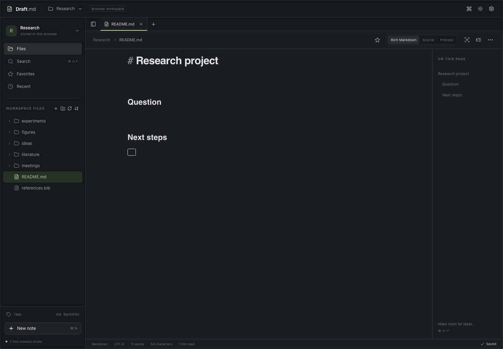

# Draft.md

A private research writing workspace that runs entirely in your browser. Open a folder, edit ordinary Markdown, and save directly to the same files. No account, application server, analytics, or AI service.

> Draft.md never requires your notes to be uploaded to a server. In supported browsers, it works directly with a directory you choose on your computer.



## Contents

- [Run locally](#run-locally)
- [Development commands](#development-commands)
- [Start writing](#start-writing)
- [What works](#what-works)
- [Local folders versus browser workspaces](#local-folders-versus-browser-workspaces)
- [Saves, conflicts, and recovery](#saves-conflicts-and-recovery)
- [Privacy and security](#privacy-and-security)
- [Offline and updates](#offline-and-updates)
- [Architecture](#architecture)
- [Keyboard operation](#keyboard-operation)
- [Troubleshooting](#troubleshooting)
- [Contribution](#contribution)
- [Repository hygiene](#repository-hygiene)
- [Scope and remaining work](#scope-and-remaining-work)
- [Acknowledgment](#acknowledgment)
- [License](#license)

## Run locally

Use Node 22.12+ (verified here with Node 26.8.2).

```sh
npm ci
npm run dev
```

Open **http://127.0.0.1:5173**. The development server is bound to your own computer. File pickers work on localhost; a deployed app needs HTTPS.

```sh
npm run lint
npm run typecheck
npm test
npm run build
npm run preview -- --port 4173
```

The production app is in `dist/`. Serve that directory with any static HTTPS host. There is no backend to configure. Deploy at an origin root; subdirectory hosting needs matching Vite base, manifest paths, and service-worker scope changes.

For integration tests:

```sh
npx playwright install chromium --only-shell
npm run test:e2e
```

You can use installed Google Chrome instead:

```sh
DRAFT_BROWSER_CHANNEL=chrome npm run test:e2e
```

The final browser checks in this environment used Chrome 154.0.8037.99. A Chromium 153 build crashed while deserializing an OPFS directory handle in a native-adapter test fixture; that isolated browser failure did not occur in installed Chrome. The native fixture uses browser-owned handles rather than an interactive operating-system folder picker. See [verification](docs/verification.md) for what was and was not exercised.

## Development commands

| Command                          | Purpose                                                                 |
| -------------------------------- | ----------------------------------------------------------------------- |
| `npm ci`                         | Install the dependency versions recorded in `package-lock.json`.        |
| `npm run dev`                    | Start the development server with hot reload.                           |
| `npm run lint`                   | Check code and configuration with ESLint.                               |
| `npm run typecheck`              | Check TypeScript without emitting application code.                     |
| `npm test`                       | Run the core Vitest suite once.                                         |
| `npm run build`                  | Check the TypeScript build and generate the production site in `dist/`. |
| `npm run preview -- --port 4173` | Serve an existing production build locally.                             |
| `npm run test:e2e`               | Run Playwright against a production preview on port 4173. Build first.  |
| `npm run benchmark`              | Measure a running production preview; uses installed Chrome by default. |
| `npm run format`                 | Format source, tests, browser tests, and scripts with Prettier.         |
| `node scripts/notices.mjs`       | Regenerate production dependency license notices.                       |

Playwright starts its preview server automatically, or reuses an existing one outside CI. Reports in `playwright-report/` and failure artifacts in `test-results/` are local outputs ignored by Git.

To reproduce the benchmark, build and start a preview in one terminal:

```sh
npm run build
npm run preview -- --port 4174
```

Run `npm run benchmark` in another terminal. `DRAFT_URL` changes its default target of `http://127.0.0.1:4174`; `DRAFT_BROWSER_CHANNEL` selects a browser channel for benchmarks and browser tests. Benchmark runs update reports and a screenshot in `docs/`; review these before committing. See [the measurement methodology](docs/performance.md) for interpretation and limits.

No environment variables, API keys, database service, or server credentials are required. Never put secrets in client configuration: values exposed to the client become part of the downloadable application.

## Start writing

1. **Open Folder** opens an existing directory without adding any files. The sidebar reflects the real hierarchy. Select a Markdown note to write in it.
2. **New Workspace** creates a new folder under a parent you choose, or a clearly labeled browser workspace. Pick Blank, Research Project, Paper, PhD Workspace, Experiment Log, Literature Review, or Lab Notebook. Templates are created only through this explicit operation.
3. Choose **Rich Markdown**, **Source**, or **Preview**. They all use the same Markdown text. Rich formatting reveals source around the cursor; CodeMirror retains each tab’s selection, history, and scrolling.
4. Edits autosave after 700 ms by default. **Cmd/Ctrl+S** saves immediately. “Saved” means that exact version was persisted through the selected adapter.

Folders do not expose an absolute operating-system path. Draft.md displays the handle name and relative file paths, never a guessed `~/Documents/...` path.

## What works

- Direct folder editing, recent workspace handles, explicit permission renewal, and an OPFS browser workspace with an IndexedDB fallback.
- Lazy folder expansion; large flat file lists render only a window of rows. Nested Markdown, text, bibliography files, images, PDFs, and arbitrary downloadable assets remain regular files.
- New notes and folders; rename, duplicate, move by path or folder drag/drop; permanent deletion with confirmation; sorting, refresh, and relative-path copying. Copies are verified byte-for-byte, then the source is checked again before removal. A partial failure retains recoverable copies and reports what happened.
- Multiple tabs, dirty indicators, close buttons, middle-click close, recently closed tabs, favorites, and recent notes. Pending edits block tab closure/workspace switching when saving fails.
- Headings, emphasis, lists, tasks, quotes, tables, code, links, local images, GFM, single-line footnotes, and optional collapsible frontmatter in preview.
- On-demand KaTeX equations and Mermaid diagrams; highlighted Python, Bash, JSON, YAML, C++, JavaScript, TypeScript, Rust, R, Julia, SQL, and LaTeX. Code blocks are never executed. Rich and preview code blocks have copy actions.
- Research callouts in preview, academic citation recognition, wiki-link navigation with heading targets and an explicit chooser for ambiguous names. Rich mode decorates citation/wiki syntax; interactive wiki navigation is available in preview.
- Worker-based local filename/content search with snippets and line targets, fuzzy Quick Open, command palette, a live outline derived from the Markdown syntax tree, and workspace-local tags/wiki backlinks derived from files.
- Paste/drop images into the editor: bytes go to `assets/`, collisions receive numbered names, and nested notes receive correct relative paths. Local image/PDF viewers read workspace bytes into object URLs and release them on close.
- Configurable themes, writing font/size/line height, wrapping, spellcheck, tab width, density, sidebar width, autosave, assets folder, Markdown capabilities, focus mode, and typewriter scrolling. Use **Writing tools** to insert ordinary Markdown or add/delete table rows/columns and cycle alignment.
- File/folder import, ZIP import with path/size validation, complete ZIP backups preserving directories and binary assets, individual Markdown download, standalone HTML with embedded local images/fonts, copy as HTML, and browser print/PDF export.
- Installable manifest, icons, service worker, and offline application assets—including lazy math, diagram, language, and archive code.

## Local folders versus browser workspaces

**Local Folder — Recommended:** Files remain in the directory you selected. Editing `papers/audio-reasoning.md` writes to that file. Other tools can read those same bytes. IndexedDB stores app metadata and handles, not an authoritative copy of the workspace.

**Browser Workspace:** Files live in OPFS (or IndexedDB when OPFS is unavailable). They are **not** ordinary files in a visible computer directory. Storage is tied to the origin/browser profile. Clearing site data, private browsing teardown, or browser eviction can remove it. Use the workspace menu’s **Export ZIP / Back up** regularly, and keep the downloaded archive outside the browser. A ZIP can be imported later into either storage type.

ZIP import uses a new collision-safe `Imported` folder so internal relative references remain intact. Folder import preserves its incoming hierarchy. Individual filename collisions get numbered names. ZIP input is limited to 100 MB compressed / 250 MB expanded. Import/export currently operate in memory; large archives can consume substantial RAM. ZIP backups include hidden directories and binary files. Background search excludes hidden directories. Folder imports preserve file hierarchy under a collision-safe root; empty directories need ZIP import because browser folder-upload FileLists contain only files.

Direct directory selection is capability-detected. Chromium desktop browsers generally provide the picker; Safari and Firefox users can use browser storage. Availability depends on the specific browser, secure context, user activation, and permissions. See the official [directory picker documentation](https://developer.mozilla.org/en-US/docs/Web/API/Window/showDirectoryPicker) and [File System API](https://developer.mozilla.org/en-US/docs/Web/API/File_System_API). Browser availability was checked during implementation; no cross-browser compatibility claim is based solely on a browser name.

## Saves, conflicts, and recovery

Writes are serialized per document. Before saving, the controller compares disk text to the saved baseline. A newer in-memory edit remains dirty even if an older write completes. Read, write, quota, permission, and recovery-checkpoint failures retain the editor text and show an actionable save failure.

On window focus/visibility return, open documents are checked for external changes. A changed file prompts **Compare**, **Reload disk version**, or **Keep Draft.md version**. Compare shows the full versions with changed lines highlighted. Keeping Draft.md explicitly authorizes overwriting the current disk text; reloading explicitly discards the pending draft. Even a clean external change requests a choice. Deleted/renamed files are not silently recreated; download the draft or reopen/recreate a file explicitly.

Temporary recovery snapshots live in IndexedDB, keyed by workspace and relative path. They contain pending text and its baseline, are checkpointed after 200 ms of inactivity, and are removed after a successful save. Reopening recovers available drafts; the workspace menu also lets you download recovery drafts for missing files. This is the sole persistent content copy used in local-folder mode. An abrupt browser/process failure can lose keystrokes before the checkpoint completes. Unload warnings help but cannot force a browser to finish asynchronous writes.

The File System Access API does not offer a universal compare-and-swap operation or atomic cross-folder rename. An external process can still change a file between the last comparison and the write/remove operation. Draft.md reduces and reports conflicts; it cannot promise cross-process locking or fully atomic cross-platform saves. Avoid simultaneous writers for the same file. Large directory moves copy before removal and can leave partial destination folders on failure; originals are retained until verification succeeds.

## Privacy and security

Document text, filenames, searches, tags, citations, and assets are processed locally. There are no analytics or content-processing endpoints. Application code is downloaded from the app origin; that is distinct from uploading a workspace.

DOMPurify sanitizes rendered Markdown/HTML. Unsafe link schemes, event handlers, active embeds, remote images, and paths escaping the granted root are blocked. KaTeX runs with trust disabled. Mermaid uses strict security, text labels, sanitized SVG, and rejects remote-resource/CSS-URL directives before rendering. External web links open only on an explicit click. Markdown with a remote image shows an unavailable-resource message instead of silently fetching it.

Service-worker caches contain application resources, never workspace files or search results. Temporary recovery drafts and browser workspaces are local site data; the app does not encrypt them. Device/browser-profile access controls still apply.

## Offline and updates

`npm run dev` intentionally has no service worker. Test offline behavior against the production build.

The first successful production load installs and precaches the full offline shell, bundled fonts, and dynamically loaded capabilities (about 6.4 MB uncompressed in this build). Wait for service-worker installation to finish before disconnecting. Afterwards, a browser workspace and previously granted local files can be reopened offline. A browser may still require explicit folder reauthorization.

Updates wait while old app clients are open. Save your work, close all Draft.md tabs, and reopen to activate an installed update. The app does not force-reload unsaved editors. Browser installation availability and UI depend on the browser; use its Install app/Add to Dock option where offered.

## Architecture

| Area                     | Responsibility                                                                                        |
| ------------------------ | ----------------------------------------------------------------------------------------------------- |
| `src/app/`               | Preact shell, start screen, sidebar, workspace/UI orchestration                                       |
| `src/filesystem/`        | Typed adapters, normalized paths, verified copies/moves, binary import and ZIP backups                |
| `src/state/documents.ts` | Per-file save serialization, conflicts, recovery, closure guards                                      |
| `src/editor/`            | CodeMirror state, selectively imported Draftly plugins, safe research rendering, standard table edits |
| `src/components/`        | Focus-managed dialogs, tree, tabs, editor pane, outline, palette, settings, asset viewers             |
| `src/search/`            | Worker-owned incremental content/knowledge index; native-handle scans where available                 |
| `src/storage/`           | IndexedDB handles/metadata/preferences and temporary recovery                                         |
| `src/styles/`            | Plain CSS, theme tokens, system fonts, responsive layout, reduced motion                              |
| `tests/`, `e2e/`         | Data-preservation/security tests and production browser workflows                                     |

CodeMirror owns each tab’s document/undo/selection state. Keystrokes update the editor and save controller directly, not Preact application text state. Outline/count/index updates are debounced; the shell and sidebar do not subscribe to editor transactions. Dirty tab indicators use a small imperative subscription. Preview renders on entering preview or after debounced updates, with stale async results discarded. Only one heavyweight editor view is mounted, while inactive tabs keep their states.

Preact keeps the shell small without a compatibility adapter for the editor: Draftly is used as a native CodeMirror extension. [Draftly evaluation](docs/draftly-evaluation.md) records the API/license inspection, source-entry choice, privacy boundaries, and measured cost. [Performance data](docs/performance.json) and the [performance report](docs/performance.md) separate shell startup from first-editor load and describe the 5,000-note benchmark.

## Keyboard operation

Cmd/Ctrl+N: new note; S: save; O: workspace chooser; P: Quick Open; Shift+P: palette; Shift+F: search; B/I/K: bold/italic/link; comma: settings; Shift+Enter: focus mode. W, Tab, and Shift+T handle close/next/reopen when the browser delivers those shortcuts. Browser-reserved shortcuts may not be interceptable; visible tab buttons, menus, and palette commands provide alternatives. Dialogs use native modal focus containment, Escape dismissal, and focus restoration. Context menus support arrow keys and Enter. The sidebar separator supports pointer dragging and arrow keys.

## Troubleshooting

| Problem                             | What to do                                                                                                                                      |
| ----------------------------------- | ----------------------------------------------------------------------------------------------------------------------------------------------- |
| **Open Folder** is unavailable      | Use localhost or HTTPS and a browser with directory picking. Otherwise choose Browser Workspace and import files.                               |
| A recent folder needs permission    | Use **Grant Access** and accept the browser prompt. If the folder moved, open it again through the picker.                                      |
| A note stays dirty or saving fails  | Keep the tab open, inspect the error, and restore access or available storage. Download the draft before closing if saving remains unavailable. |
| An external edit causes a conflict  | Compare the versions and choose which to keep. Keeping Draft.md overwrites the current file; reloading discards the pending draft.              |
| Search misses an external edit      | Use **Refresh**. Unopened files changed outside the app are not continuously watched.                                                           |
| A remote image does not render      | Import it into the workspace and use a relative path. Remote image fetching is blocked.                                                         |
| Offline mode does not work          | Use a production build, load it online, and let the service worker finish installing before disconnecting.                                      |
| A browser workspace appears missing | Check the browser profile and exact origin, including port. Restore an exported ZIP if site data was cleared.                                   |
| Browser tests cannot launch         | Install Playwright Chromium or select installed Chrome with `DRAFT_BROWSER_CHANNEL=chrome`. Build first.                                        |
| Preview shows an old build          | Rebuild. For a production app, save and close all app tabs to activate a waiting service-worker update.                                         |

Changing between `localhost` and `127.0.0.1`, HTTP and HTTPS, or different ports creates different storage origins. Export browser workspaces before changing where you run the app. Clearing site data also removes recovery snapshots and persisted handles; back up available work first.

## Contribution

Contributions are welcome: bug reports, documentation improvements, accessibility fixes, browser compatibility checks, and code changes. For a bug report, include reproduction steps, expected and actual behavior, browser version, storage mode, and relevant errors. Use a small sanitized example rather than private research notes.

For a code contribution, fork the repository, create a focused branch, install dependencies with `npm ci`, and make your change. Open a pull request describing the problem, the resulting behavior, and the checks you ran. Include screenshots for visible UI changes and disclose any checks you could not complete.

Keep changes focused and describe the user-visible behavior, validation, and storage or compatibility limitations. For code changes, run lint, typecheck, core tests, and a production build. Run browser workflows when changing editor interactions, saving, import/export, navigation, or offline behavior. Use disposable workspaces for filesystem experiments.

Preserve ordinary Markdown and relative asset paths. Saving, conflict handling, and move/delete changes should retain recoverable text and original bytes on failure. CodeMirror owns document text and history; avoid routing every keystroke through application-wide UI state. Sanitize rendered content and keep workspace processing local.

## Repository hygiene

Commit source, tests, configuration, `package.json`, `package-lock.json`, public icons, dependency notices, and useful documentation. Documentation screenshots and benchmark reports are intentional reviewable artifacts. Check screenshots and fixtures for private notes or identifying paths before committing.

The project-specific `.gitignore` excludes dependencies, production output, caches, coverage, browser-test reports, logs, environment files, personal editor settings, and operating-system metadata. Environment examples such as `.env.example` remain eligible for version control and must contain placeholders only. Markdown, images, PDFs, ZIPs, and bibliography files are not broadly ignored because they may be legitimate documentation or test fixtures. Keep personal research workspaces and backups outside the source directory.

Ignore rules do not remove already tracked files. In an existing repository, inspect `git status --short` and `git ls-files -ci --exclude-standard` before pushing; remove accidentally tracked local artifacts from the index with `git rm --cached` after reviewing the paths. This directory had no Git repository when the rules were reviewed.

## Scope and remaining work

This is a working V1 with tested storage/editor workflows, not a guarantee against every browser or filesystem failure. The following remain intentionally limited or optional:

- Full BibTeX parsing, bibliography hover details, and citation completion are deferred. Citations remain original portable Markdown; `.bib` files are editable and searchable.
- Slash-triggered commands are deferred; the functional Writing tools menu inserts the same standard Markdown. Table helpers modify a row at the cursor and the last column; escaped pipes work, but a pipe inside a complex inline-code cell can require source editing.
- Wiki navigation is interactive in preview. Backlinks currently index wiki links, not every possible relative Markdown link. Indexes are rebuilt on workspace open/refresh and updated for edited notes; unopened external edits require Refresh.
- Full note content is indexed in memory, not persisted. Search results are capped at 100. Multi-gigabyte repositories, archives, and assets are outside the measured workload.
- Frontmatter is collapsible in preview, visible source in rich/source modes. Footnote definitions are single-line. Callouts get their full named styling in preview; rich mode keeps the editable blockquote syntax.
- HTML exports embed fonts/images, but relative note/PDF links remain workspace-relative; export ZIP alongside HTML when those links matter. Print/PDF output depends on the browser’s print engine. DOCX/LaTeX export is future work.
- An interactive OS folder picker, real disk writes viewed independently in VS Code, browser permission UI, and Safari/Firefox behavior require the manual checks documented in `docs/verification.md`.
- No supplied native macOS reference screenshot was available. UI screenshots in `docs/` were generated from this implementation’s test workspaces.

## Acknowledgment

Draft.md builds on the work of open-source maintainers. Draftly 2.1.0 and CodeMirror 6 provide rich Markdown editing. Preact supports the application UI; Marked and DOMPurify handle Markdown rendering and sanitization; KaTeX and Mermaid render equations and diagrams; highlight.js provides syntax highlighting; fflate handles ZIP archives; idb simplifies IndexedDB access; and Lucide supplies icons.

Draftly and HackMD were inspected as editor and research-workflow references. The [Draftly evaluation](docs/draftly-evaluation.md) documents the integration decisions. [Third-party notices](public/THIRD_PARTY_NOTICES.txt) preserve production dependency licenses. Run `node scripts/notices.mjs` after dependency changes.

## License

Draft.md is licensed under the [MIT License](LICENSE). You may use, modify, and redistribute the project, including commercially, subject to the license terms. Preserve the copyright and permission notice when redistributing copies or substantial portions of the software.

Third-party dependencies retain their respective licenses; see [third-party notices](public/THIRD_PARTY_NOTICES.txt).
